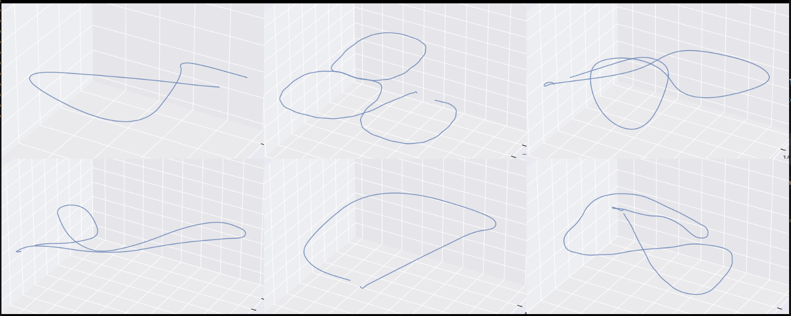

# AirSim Flight Automation

Automated UAV flight framework for Microsoft AirSim, providing repeatable trajectory execution, mission management, and autonomous data collection for robotics, computer vision, and Visual SLAM research.

---

## Overview

This project provides an automation framework for controlling UAVs in the AirSim simulator. It enables fully automated flight missions with predefined trajectories, synchronized sensor recording, and repeatable experiments, reducing manual intervention during large-scale data collection.

The framework was originally developed to support Visual SLAM benchmarking and multimodal dataset generation for UAV applications.

---



## Features

* Autonomous UAV takeoff and landing
* Waypoint-based flight execution
* Predefined and customizable flight trajectories
* Batch mission execution
* Automatic simulator reset between missions
* Repeatable experiments using fixed trajectories
* Support for RGB, Depth, Semantic, and Ground Truth data collection
* IMU synchronization support
* Configurable flight speed and altitude

---

## Project Structure

```text
AirSim-Flight-Automation/
│
├── trajectories/         
└── README.md
```

---

## Flight Workflow

```text
Launch AirSim
        │
        ▼
Connect to Simulator
        │
        ▼
Load Mission
        │
        ▼
Load Trajectory
        │
        ▼
Automatic Takeoff
        │
        ▼
Execute Waypoints
        │
        ▼
Collect Sensor Data
        │
        ▼
Automatic Landing
        │
        ▼
Reset Simulation
```

---

## Flight Capabilities

The framework supports:

* Fixed waypoint missions
* Repeatable flight experiments
* City-scale trajectory execution
* Multiple predefined flight routes
* Adjustable flight parameters

  * Flight speed
  * Altitude
  * Sampling frequency
  * Mission duration

---

## Supported Sensors

Typical sensor streams include:

* RGB Camera
* Depth Camera
* Semantic Segmentation Camera
* Ground Truth Pose
* IMU

Additional sensors can be added through AirSim configuration.

---

## Example Usage

Launch AirSim and execute a predefined mission:

```bash
python Trajectories/simple_drone_cross_building.py
---

## Applications

This framework is suitable for:

* Visual SLAM benchmarking
* Robotics perception
* UAV navigation
* Autonomous flight simulation
* Computer vision research
* Dataset generation
* Sensor synchronization experiments

---

## Future Improvements

Planned features include:

* Random trajectory generation
* Dynamic obstacle avoidance
* Multi-UAV support
* ROS integration
* Mission visualization
* YAML-based mission configuration
* Real-time trajectory monitoring

---

## Dependencies

* Python 3.x
* Microsoft AirSim
* NumPy
* OpenCV
* msgpack-rpc-python

Additional dependencies may be required depending on the experiment setup.

---

## License

This project is released under the MIT License.
