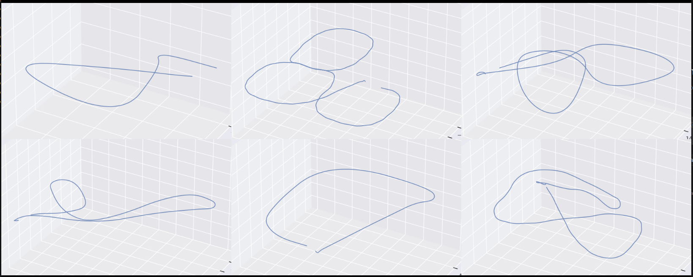

# AirSim Flight Automation

UAV flight control and route execution for the current ADK5.6.2 workflow. Sensor recording is maintained separately in `../FlightDataCollection/ros2_image_pose_recorder.py`.

---

## Overview

Current routes use ROS2 and `adk_node.msg.WaypointPath`. The `Trajectories/OldVersion/` scripts use the older AirSim Python SDK and are retained pending archival under `legacy/airsim/`; they are not the current flight entry points. Some ADK ROS topic names still contain `airsim`.

The framework was originally developed to support Visual SLAM benchmarking and multimodal dataset generation for UAV applications.

---



## Features

* Autonomous UAV takeoff and landing
* Waypoint-based flight execution
* Predefined and customizable flight trajectories
* Batch mission execution
* Automatic simulator reset between missions
* Repeatable experiments using fixed trajectories
* Support for RGB, Depth, Semantic, and Ground Truth data collection
* IMU synchronization support
* Configurable flight speed and altitude

---

## Project Structure

```text
FlightAutomation/
│
├── Trajectories/
│   ├── ADK5.6.2/
│   └── OldVersion/       # historical SDK code, archival pending
└── README.md
```

---

## Flight Workflow

```text
Launch AirSim
        │
        ▼
Connect to Simulator
        │
        ▼
Load Mission
        │
        ▼
Load Trajectory
        │
        ▼
Automatic Takeoff
        │
        ▼
Execute Waypoints
        │
        ▼
Collect Sensor Data
        │
        ▼
Automatic Landing
        │
        ▼
Reset Simulation
```

---

## Flight Capabilities

The framework supports:

* Fixed waypoint missions
* Repeatable flight experiments
* City-scale trajectory execution
* Multiple predefined flight routes
* Adjustable flight parameters

  * Flight speed
  * Altitude
  * Sampling frequency
  * Mission duration

---

## Supported Sensors

Typical sensor streams include:

* RGB Camera
* Depth Camera
* Semantic Segmentation Camera
* Ground Truth Pose

Additional sensors can be added through AirSim configuration.

---

## Example Usage

With the ADK simulator and ROS2 bridge already configured, run a route from the repository root:

```bash
python3 FlightAutomation/Trajectories/ADK5.6.2/simple_drone_cross_building.py
```

The maintained image viewer is now `FlightDataCollection/camera_view.py` (repository-root path). It retains the active ADK viewer's RGB default and depth display behavior. Recording and the viewer are started separately; the viewer does not change saved depth units.

---

## Applications

This framework is suitable for:

* Visual SLAM benchmarking
* Robotics perception
* UAV navigation
* Autonomous flight simulation
* Computer vision research
* Dataset generation
* Sensor synchronization experiments

---

## Future Improvements


---

## Dependencies

* Python 3.10
* ADK5.6.2 and its ROS2 bridge
* ROS2 `rclpy`, `geometry_msgs`, and `nav_msgs`
* `adk_node` message definitions

---

## License

