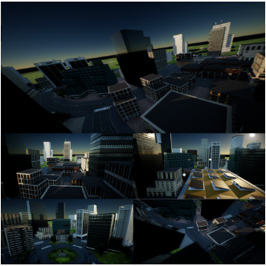
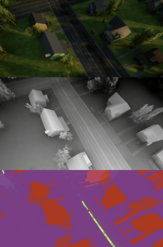

# AirSim Visual SLAM Research Toolkit

A modular toolkit for autonomous UAV flight, multimodal dataset collection, Visual SLAM benchmarking, and experiment automation in Microsoft AirSim.

This project was developed as part of my Master's research on **Visual SLAM for UAV applications**, providing an end-to-end pipeline from autonomous flight execution to dataset generation and SLAM evaluation.

---

## Overview

The toolkit is organized into four independent modules:

* **AirSim Flight Automation** – Autonomous UAV flight and mission execution.
* **AirSim Dataset Collection** – Automated multimodal sensor data acquisition.
* **AirSim Benchmark** – Visual SLAM evaluation and performance analysis.
* **AirSim Utilities** – Shared tools for data processing, visualization, and experiment management.

Each module can be used independently or combined into a complete experimental workflow.



---

# Repository Structure

```text
AirSim-VisualSLAM-Toolkit/
│
├── FlightAutomation/
│   ├── trajectories/
│   └── README.md
│
├── DatasetCollection/
│
├── Benchmark/
│
├── Utilities/
│
├── docs/
|   |── images/
└── README.md
```

---

# Module Description

## Flight Automation

Provides autonomous UAV mission execution inside AirSim.

### Features

* Autonomous takeoff and landing
* Waypoint navigation
* Configurable flight speed and altitude
* Batch mission execution
* Automatic simulator reset
* Repeatable flight experiments

---

## Dataset Collection

Provides automated data acquisition for UAV perception research.

### Supported Data

* RGB images
* Depth images
* Semantic segmentation
* Ground truth pose
* IMU measurements

### Features

* Automatic synchronized recording
* Configurable sampling frequency
* Organized dataset structure
* Timestamp management

---

## Benchmark

Provides a unified evaluation pipeline for Visual SLAM algorithms.

### Supported Evaluation

* Trajectory comparison
* Absolute Trajectory Error (ATE)
* Runtime analysis
* Trajectory visualization

Designed to simplify comparisons between different Visual SLAM methods under identical flight conditions.

---

## Utilities

Contains reusable tools shared across the project.

Examples include:

* Camera configuration
* Timestamp synchronization
* Dataset conversion
* Image processing
* Depth visualization
* Logging
* Common helper functions

---

# Workflow

```text
Mission Planning
        │
        ▼
Flight Automation
        │
        ▼
Dataset Collection
        │
        ▼
Visual SLAM
        │
        ▼
Benchmark Evaluation
        │
        ▼
Performance Analysis
```

---

# Technologies

* Microsoft AirSim
* Python
* ROS / ROS2
* NumPy
* OpenCV
* EVO
* Visual SLAM
* UAV Simulation

---

# Applications

This project can be used for:

* Visual SLAM research
* Robotics perception
* UAV simulation
* Autonomous navigation
* Computer vision experiments
* Dataset generation
* Algorithm benchmarking

---

# Future Work

---

# License
