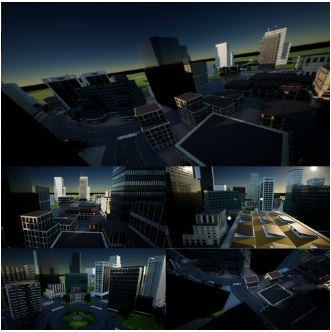
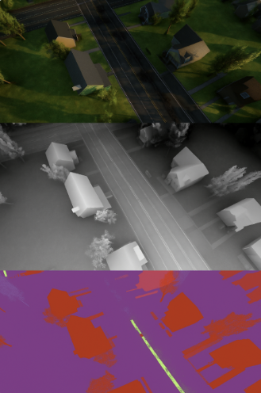
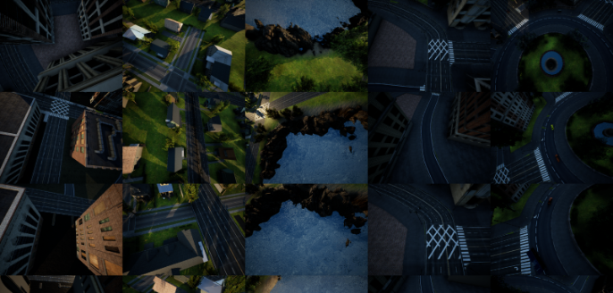

# AirSim Visual SLAM Research Toolkit

A toolkit for autonomous UAV flight, multimodal dataset collection, and Visual SLAM benchmarking. The current collection and flight-control workflow uses **ADK5.6.2**.

This project was developed as part of my Master's research on **Visual SLAM for UAV applications**, providing an end-to-end pipeline from autonomous flight execution to dataset generation and SLAM evaluation.

---

## Overview

The toolkit separates these responsibilities:

* **FlightAutomation** – ADK flight control and route execution.
* **FlightDataCollection** – Current ADK sensor recording and collection helpers.
* **Benchmark** – Evaluation, metrics, statistics, conversions, and evaluation plots.
* **Utilities** – Reusable basic tools; module-specific scripts are being relocated in small batches.
* **Paper** – Paper materials and figures. Evaluation plotting programs belong in Benchmark.

The paper uses ADK data exclusively. Older AirSim SDK collection and flight-control programs are retained pending separate archival under `legacy/airsim/`; they are not current entry points. Names and ROS topics containing `airsim` can still be used by ADK and do not identify a program or dataset as obsolete. Existing CSVs, PNGs, and embedded numeric tables have not all been source-verified.




---

# Repository Structure

```text
AirSim-Visual-SLAM-Research-Toolkit/
├── FlightAutomation/
│   ├── Trajectories/ADK5.6.2/
│   ├── Trajectories/OldVersion/  # historical SDK code, archival pending
│   └── README.md
├── FlightDataCollection/
│   ├── ros2_image_pose_recorder.py
│   └── camera_view.py
├── Benchmark/
│   ├── experiment_data/
│   ├── statistics/
│   ├── visualization/
│   └── convert_tum.py
├── Utilities/
├── Paper/
├── docs/images/
└── README.md
```

---

# Module Description

## Flight Automation

Current routes are under `FlightAutomation/Trajectories/ADK5.6.2/` and use the ROS2 `adk_node` interfaces. See [flight-control instructions](FlightAutomation/README.md).

### Features

* Autonomous takeoff and landing
* Waypoint navigation
* Configurable flight speed and altitude
* Batch mission execution
* Automatic simulator reset
* Repeatable flight experiments

---

## Dataset Collection

The maintained recorder is `FlightDataCollection/ros2_image_pose_recorder.py`. It subscribes to RGB, depth, semantic images, and ground-truth pose; depth is saved as uint16 millimeter PNGs. Configure its existing topic and save-directory constants for the current ADK deployment before starting it.

From the repository root, in the configured ADK ROS2 environment:

```bash
python3 FlightDataCollection/ros2_image_pose_recorder.py
python3 FlightDataCollection/camera_view.py
```

Run the viewer separately from the recorder. The viewer retains the active ADK version's default `mode = 'rgb'`; its existing `depth` mode decodes `32FC1` and displays 0.5–50 meters as uint8 grayscale. This display conversion does not change the recorder's saved depth format or units. The unused Utilities viewer and older AirSim publisher are not current entry points.

### Supported Data

* RGB images
* Depth images
* Semantic segmentation
* Ground truth pose

### Features

* Automatic synchronized recording
* Configurable sampling frequency
* Organized dataset structure
* Timestamp management

---

## Benchmark

Provides a unified evaluation pipeline for Visual SLAM algorithms.

### Supported Evaluation

* Trajectory comparison
* Absolute Trajectory Error (ATE)
* Runtime analysis
* Trajectory visualization

Designed to simplify comparisons between different Visual SLAM methods under identical flight conditions.

### Preserved ATE/MTP figures

The two programs below reproduce the existing embedded ATE/MTP tables. Their numeric provenance has not been verified; these commands do not incorporate those values into current paper statistics. They preserve the values, metric calculations, filenames, and layout. Select an explicit output directory rather than writing into paper materials implicitly:

```bash
python3 Benchmark/visualization/ATE_MTP_heat_map.py \
  --output-dir /tmp/toolkit-evaluation-figures
python3 Benchmark/visualization/combine_ATE_MTP_images.py \
  --input-dir /tmp/toolkit-evaluation-figures \
  --output /tmp/toolkit-evaluation-figures/Combined_3_Heatmaps.png
```

Use `MPLBACKEND=Agg` for headless plotting. The first command writes five heatmaps; the second combines the mono ATE, RGB-D ATE, and combined MTP images. Runtime dependencies are NumPy, pandas, Matplotlib, and Pillow.

### Ground-truth index conversion

`Benchmark/convert_tum.py` replaces the timestamp column with indices starting at 1.0 and increasing by 0.1, preserving the existing eight-column filtering and six-decimal formatting. It requires explicit input paths; it does not run the former hardcoded dataset directory automatically.

```bash
python3 Benchmark/convert_tum.py \
  --input /path/to/groundtruth.txt --output /path/to/groundtruth_index.txt
python3 Benchmark/convert_tum.py \
  --dataset-root /path/to/datasets --datasets building25fps road25fps
```

Batch mode reads `DATASET/groundtruth.txt` and writes `DATASET/groundtruth_index.txt`. Omitting `--datasets` uses the preserved original sequence list. The existing DSO, TartanVO, and VGGT-LONG evaluation readers retain their run-directory input paths; this converter does not deploy files into those runs.

---

## Utilities

Intended for reusable basic tools shared across modules. Collection-specific helpers belong with the current collection workflow or the historical SDK archive, and benchmark-only analysis and plotting belong in Benchmark. Remaining candidates are being reviewed by implementation and usage rather than by filename.

Examples include:

* Camera configuration
* Timestamp synchronization
* Dataset conversion
* Image processing
* Depth visualization
* Logging
* Common helper functions

---

# Workflow

```text
Mission Planning
        │
        ▼
Flight Automation
        │
        ▼
Dataset Collection
        │
        ▼
Visual SLAM
        │
        ▼
Benchmark Evaluation
        │
        ▼
Performance Analysis
```

---

# Technologies

* Microsoft AirSim
* Python
* ROS / ROS2
* NumPy
* OpenCV
* EVO
* Visual SLAM
* UAV Simulation

---

# Applications

This project can be used for:

* Visual SLAM research
* Robotics perception
* UAV simulation
* Autonomous navigation
* Computer vision experiments
* Dataset generation
* Algorithm benchmarking

---

# Future Work

---

# License
